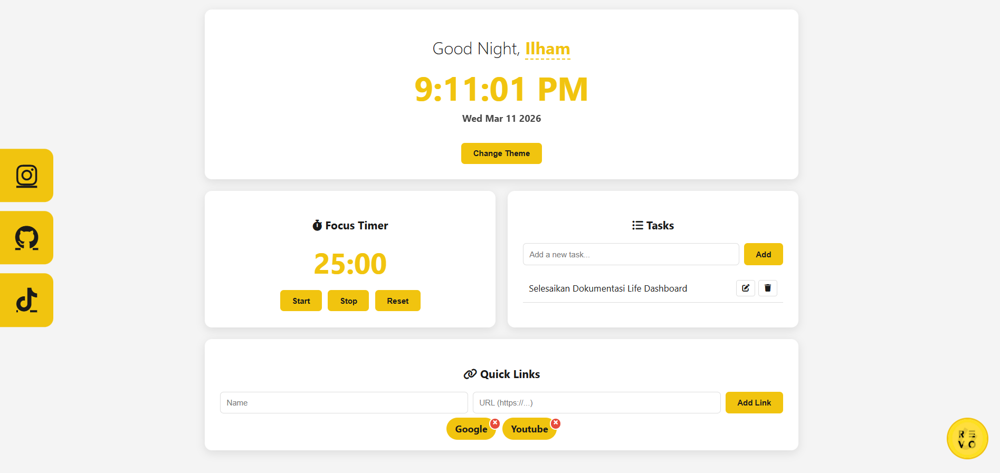
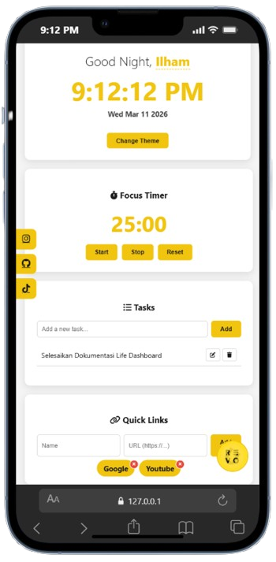

# Mini Coding Project - Life Dashboard

A modern, cyberpunk-themed productivity dashboard built with vanilla JavaScript. This single-page application combines time awareness, task management, focus timing, and quick access to favorite websites—all with a sleek cyberpunk yellow aesthetic and complete client-side data persistence.

## 📸 Previews

| Desktop Version | Mobile Version |
|:---------------:|:--------------:|
|  |  |

## ✨ Features

- 🌅 **Dynamic Greeting & Name Persistence** - Time-aware greetings (Morning/Afternoon/Evening) with customizable user name
- ⏱️ **Pomodoro Focus Timer** - 25-minute countdown timer with Start, Stop, and Reset controls
- ✅ **Task Management (CRUD)** - Add, edit, mark complete, and delete tasks with case-insensitive duplicate prevention
- 🔗 **Quick Links Manager** - Save and access favorite websites with automatic URL normalization
- 🎨 **Cyberpunk Light/Dark Mode** - Toggle between themes with cyberpunk yellow accent (#f39c12) and persistent preference

## 🛠️ Technical Stack

- **HTML5** - Semantic structure with accessibility (ARIA labels)
- **CSS3** - Responsive design with CSS variables and custom animations
- **Vanilla JavaScript** - Object-Oriented (Class-based) architecture with no frameworks
- **Local Storage API** - Client-side data persistence with robust error handling

## 🏗️ Project Architecture

The application follows a modular component-based architecture with clear separation of concerns:

- **StorageService** - Centralized Local Storage abstraction with error handling (QuotaExceededError, unavailable storage)
- **ThemeManager** - Controls light/dark mode switching and persistence
- **GreetingComponent** - Manages time display, date, and personalized greeting
- **FocusTimerComponent** - Implements 25-minute Pomodoro timer with state management
- **TaskManagerComponent** - Handles all task CRUD operations with duplicate validation
- **QuickLinksComponent** - Manages favorite website links with URL normalization

## 🚀 How to Run

1. Clone this repository:
   ```bash
   git clone <repository-url>
   cd todo-list-life-dashboard
   ```

2. Open `index.html` in your browser:
   - Double-click the file, or
   - Right-click → Open with → Your preferred browser

3. Start using the dashboard immediately - no installation or build process required!

## 📂 Project Structure

```
todo-list-life-dashboard/
├── index.html          # Main HTML file with semantic structure
├── css/
│   └── style.css       # Cyberpunk yellow theme styling
├── js/
│   └── script.js       # All component classes and application logic
└── images/             # Screenshots for documentation
    ├── desktop-screen.png
    └── mobile-screen.png
```

## 🎯 Key Highlights

- ✅ **Zero Dependencies** - Pure vanilla JavaScript with no external libraries
- ✅ **Fully Responsive** - Optimized for desktop and mobile devices
- ✅ **Accessible** - WCAG-compliant with proper ARIA labels and semantic HTML
- ✅ **Privacy-First** - All data stored locally in browser, no server communication
- ✅ **Error Resilient** - Graceful handling of storage quota and availability issues
- ✅ **Modern Browser Support** - Compatible with Chrome 90+, Firefox 88+, Edge 90+, Safari 14+

## 👨‍💻 Author

**Muhammad Ilham Setiawan**

Built as part of ReVoU SECC Mini Project

---

*This project demonstrates professional software engineering practices including requirements analysis, technical design, modular architecture, and clean code principles.*
